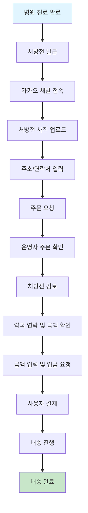
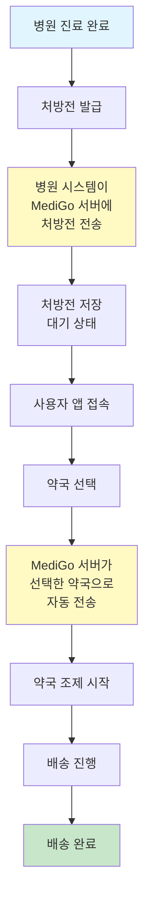
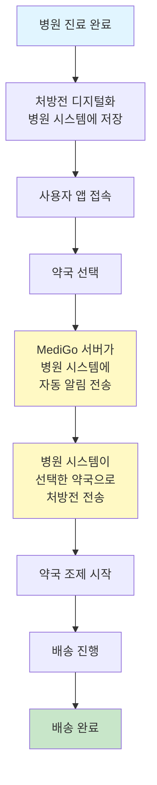
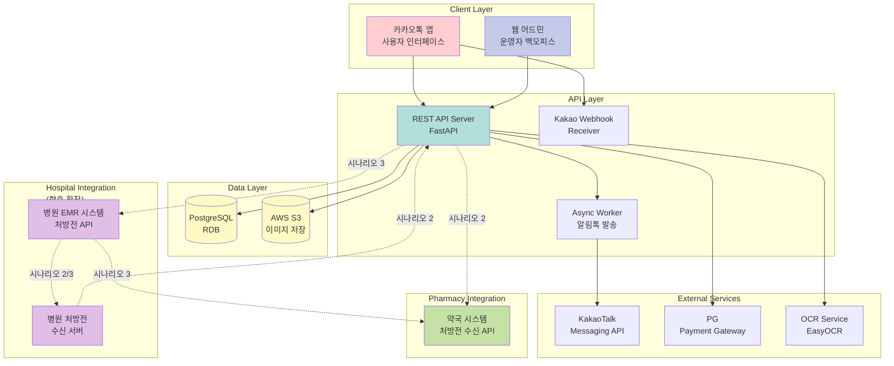
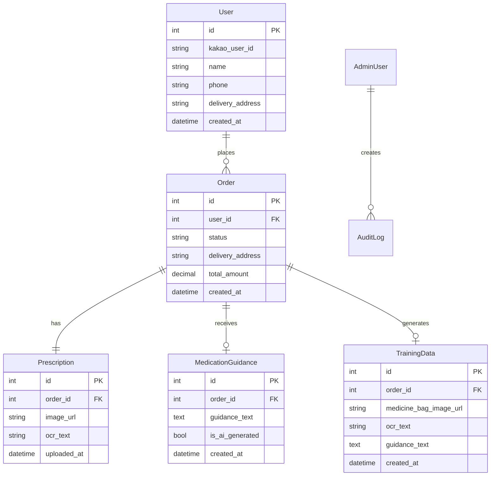
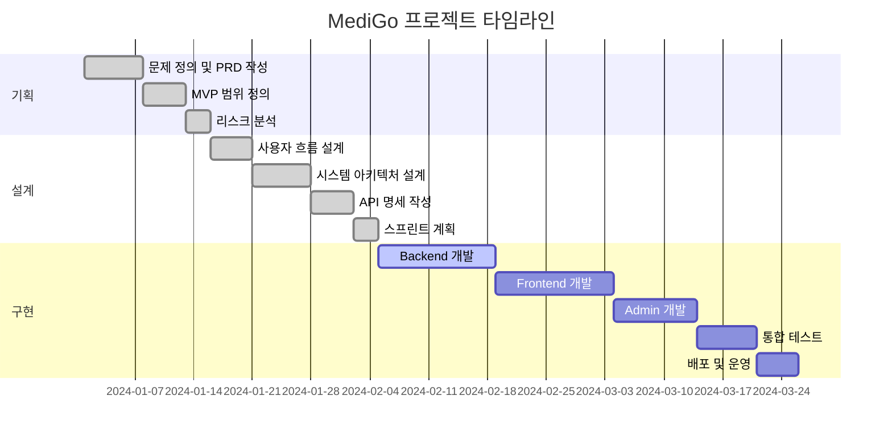

# MediGo 프로젝트 문서

AI 기반 약 배달 및 복약 지도 서비스 - 전체 프로젝트 문서 모음

---

## 목차

- [프로젝트 개요](#프로젝트-개요)
- [문서 구조](#문서-구조)
- [프로젝트 단계별 요약](#프로젝트-단계별-요약)
- [핵심 다이어그램](#핵심-다이어그램)
- [문서 링크](#문서-링크)

---

## 프로젝트 개요

**MediGo**는 처방전을 디지털로 처리하여 약국 조제 및 배달을 대행하고, 복약 지도 메시지를 앱을 통해 텍스트로 전달하는 서비스입니다.

### 핵심 가치

- **시간 절약**: 병원 방문 후 약 수령까지 평균 이동·대기 시간 30분 이상 단축
- **편의성**: 약국 재고 확인 없이 배달 가능한 약국 자동 매칭
- **안전성**: 복약 정보를 이해하기 쉽게 전달하여 집에서도 안전하게 복용

### 처방전 처리 시나리오 (고려 중)

현재 MVP에서는 **시나리오 1**을 구현하고 있으며, 향후 확장을 위해 **시나리오 2, 3**도 함께 고려하고 있습니다:

1. **시나리오 1 (현재 MVP)**: 사용자가 카카오 채널을 통해 처방전 사진 직접 업로드
2. **시나리오 2 (고려 중)**: 병원에서 우리 서버에 처방전을 미리 전송 → 사용자가 약국 선택 시 자동 전달
3. **시나리오 3 (고려 중)**: 병원이 처방전을 디지털로 보관 → 사용자가 약국 선택 시 병원에 자동 알림 → 병원이 약국으로 전송

### MVP 운영 방식

MVP 단계에서는 **Wizard of Oz 방식**으로 운영하며, 사용자에게 서비스 가치를 제공하면서 동시에 AI 모델 학습을 위한 데이터를 수집합니다.

---

## 문서 구조

```
01 - Documents/
├── 00 - 개발문서/          # 기술 문서 (API, 설정, 배포)
│   ├── API.md
│   ├── SETUP.md
│   ├── DEPLOYMENT.md
│   └── KAKAO_CHANNEL_SETUP.md
│
├── 01 - 기획/              # 프로젝트 기획 단계
│   ├── 01_문제정의PRD.md
│   ├── 02_MVP범위우선순위.md
│   └── 03_리스크제약정리.md
│
├── 02 - 설계/              # 시스템 설계 단계
│   ├── 00_SUMMARIZED.md
│   ├── 01_설계패키지.md
│   ├── 02_API명세.md
│   ├── 03_스프린트백로그.md
│   └── 04_테스트계획.md
│
└── 03 - 구현/              # 실행 및 운영 단계
    ├── 01_MVP실행패키지.md
    ├── 02_발표자료구성.md
    ├── 03_데모스크립트.md
    ├── 04_운영모니터링.md
    ├── 05_기술요약.md
    └── 06_릴리즈노트_v1.md
```

---

## 프로젝트 단계별 요약

### 01 - 기획 (Planning)

**목표**: MVP를 정의하고 성공 기준을 수치화

#### 주요 산출물

| 문서 | 내용 |
|------|------|
| **문제정의PRD** | 문제 정의, 페르소나, 사용자 시나리오, 요구사항 분석 |
| **MVP범위우선순위** | MoSCoW 우선순위, RICE 스코어, MVP 범위 정의 |
| **리스크제약정리** | 주요 리스크 목록, 제약 조건, 의존성 분석 |

#### 핵심 결정사항

- **핵심 문제**: "처방전 → 약 수령"까지의 이동·대기 시간 단축
- **성공 기준**: 
  - 평균 이동·대기 시간 30분 이상 단축
  - 약국 두 군데 이상 방문 비율 0% 수렴
  - 추천 의향 80% 이상
- **MVP 범위**: 카카오 채널 기반 주문 접수 → 운영자 처리 → 배달 완료

---

### 02 - 설계 (Design)

**목표**: 사용자 흐름과 기술 설계를 동결

#### 주요 산출물

| 문서 | 내용 |
|------|------|
| **SUMMARIZED** | 사용자 흐름, 와이어프레임, 시스템 아키텍처, ERD, API 명세, 스프린트 계획 |
| **설계패키지** | 유저 플로우, 와이어프레임, 아키텍처 다이어그램, ERD 요약 |
| **API명세** | 핵심 엔드포인트 정의 (OpenAPI 문서와 병행) |
| **스프린트백로그** | 작업 티켓 템플릿, 스프린트 범위, 마일스톤 |
| **테스트계획** | 테스트 범위, 전략, 케이스, 수용 기준 |

#### 핵심 설계 요소

- **사용자 흐름**: 
  - 시나리오 1: 처방전 업로드 → 주문 확인 → 결제 → 배송 → 완료 (현재)
  - 시나리오 2: 약국 선택 → 자동 전송 → 배송 → 완료 (고려 중)
  - 시나리오 3: 약국 선택 → 병원 알림 → 병원 전송 → 배송 → 완료 (고려 중)
- **시스템 아키텍처**: 카카오톡 채널 + 웹 어드민 + REST API + PostgreSQL + S3 + 병원/약국 연동 (확장 가능)
- **데이터 모델**: User, Order, Prescription, MedicationGuidance, TrainingData

---

### 03 - 구현 (Implementation)

**목표**: 실제로 돌릴 수 있는 패키지 완성

#### 주요 산출물

| 문서 | 내용 |
|------|------|
| **MVP실행패키지** | 실행 방법, 포함물, 환경 변수, 시드 데이터 |
| **발표자료구성** | 발표 구조 가이드 (문제 → 해결책 → 데모 → 성과) |
| **데모스크립트** | 시연 시 따라 읽을 스크립트 |
| **운영모니터링** | 로그/모니터링 포인트, 헬스 체크, 운영 체크리스트 |
| **기술요약** | 아키텍처, API/데이터 모델, 로깅 요약 |
| **릴리즈노트** | 버전 정보, 포함 기능, 알려진 이슈 |

#### 핵심 구현 내용

- **기술 스택**: FastAPI + React + PostgreSQL + AWS S3 + EasyOCR
- **배포 방식**: Docker Compose 또는 AWS EC2/RDS/S3
- **운영 모드**: Wizard of Oz (운영자 수동 처리 + AI 데이터 수집)

---

## 핵심 다이어그램

### 1. 사용자 흐름 - 시나리오별 비교

#### 시나리오 1: 사용자 직접 업로드 (현재 MVP)



**특징**: 사용자가 직접 처방전을 업로드하는 방식 (현재 구현)

---

#### 시나리오 2: 병원 서버 사전 전송 (고려 중)



**특징**: 병원에서 미리 처방전을 전송해두고, 사용자가 약국만 선택하면 자동 전달

**장점**: 
- 사용자 업로드 단계 생략
- 처방전 품질 보장
- 빠른 처리 속도

---

#### 시나리오 3: 병원 디지털 보관 + 자동 알림 (고려 중)



**특징**: 병원이 처방전을 디지털로 보관하고, 사용자가 약국 선택 시 자동으로 병원에 알림 → 병원이 약국으로 전송

**장점**:
- 병원 시스템과의 직접 연동
- 처방전 보안 강화
- 실시간 처방전 상태 관리

---

### 시나리오 비교표

| 구분 | 시나리오 1<br/>(현재 MVP) | 시나리오 2<br/>(고려 중) | 시나리오 3<br/>(고려 중) |
|------|-------------------------|------------------------|------------------------|
| **처방전 전송 주체** | 사용자 직접 업로드 | 병원 → MediGo 서버 | 병원 → 약국 (자동) |
| **처방전 저장 위치** | MediGo 서버 | MediGo 서버 (사전 저장) | 병원 시스템 |
| **약국 선택 시점** | 업로드 후 | 앱 접속 시 | 앱 접속 시 |
| **처방전 전달 방식** | 운영자 수동 처리 | MediGo 서버 자동 전송 | 병원 시스템 자동 전송 |
| **구현 난이도** | 낮음 | 중간 | 높음 |
| **처리 속도** | 보통 | 빠름 | 매우 빠름 |
| **보안 수준** | 보통 | 높음 | 매우 높음 |
| **병원 연동 필요** | 없음 | 필요 | 필요 |

### 2. 시스템 아키텍처 (확장 가능 구조)



**현재 구현**: 실선 화살표 (시나리오 1)  
**향후 확장**: 점선 화살표 (시나리오 2, 3)

### 3. 데이터 모델 (ERD)



### 4. 프로젝트 진행 단계



---

## 문서 링크

### 개발 문서 (기술 가이드)

| 문서 | 설명 |
|------|------|
| [API.md](00%20-%20개발문서/API.md) | REST API 엔드포인트 명세 |
| [SETUP.md](00%20-%20개발문서/SETUP.md) | 프로젝트 설정 가이드 |
| [DEPLOYMENT.md](00%20-%20개발문서/DEPLOYMENT.md) | AWS 배포 가이드 |
| [KAKAO_CHANNEL_SETUP.md](00%20-%20개발문서/KAKAO_CHANNEL_SETUP.md) | 카카오톡 채널 설정 가이드 |

### 기획 문서

| 문서 | 설명 |
|------|------|
| [문제정의PRD.md](01%20-%20기획/01_문제정의PRD.md) | 문제 정의, 페르소나, 요구사항 분석 |
| [MVP범위우선순위.md](01%20-%20기획/02_MVP범위우선순위.md) | MoSCoW 우선순위, MVP 범위 정의 |
| [리스크제약정리.md](01%20-%20기획/03_리스크제약정리.md) | 리스크 목록, 제약 조건, 의존성 |

### 설계 문서

| 문서 | 설명 |
|------|------|
| [SUMMARIZED.md](02%20-%20설계/00_SUMMARIZED.md) | 사용자 흐름, 아키텍처, ERD, API, 스프린트 요약 |
| [설계패키지.md](02%20-%20설계/01_설계패키지.md) | 유저 플로우, 와이어프레임, 아키텍처 다이어그램 |
| [API명세.md](02%20-%20설계/02_API명세.md) | 핵심 엔드포인트 정의 |
| [스프린트백로그.md](02%20-%20설계/03_스프린트백로그.md) | 작업 티켓, 스프린트 범위, 마일스톤 |
| [테스트계획.md](02%20-%20설계/04_테스트계획.md) | 테스트 전략, 케이스, 수용 기준 |

### 구현 문서

| 문서 | 설명 |
|------|------|
| [MVP실행패키지.md](03%20-%20구현/01_MVP실행패키지.md) | 실행 방법, 포함물, 환경 변수 |
| [발표자료구성.md](03%20-%20구현/02_발표자료구성.md) | 발표 구조 가이드 |
| [데모스크립트.md](03%20-%20구현/03_데모스크립트.md) | 시연 스크립트 |
| [운영모니터링.md](03%20-%20구현/04_운영모니터링.md) | 로그/모니터링 포인트, 체크리스트 |
| [기술요약.md](03%20-%20구현/05_기술요약.md) | 아키텍처, API, 로깅 요약 |
| [릴리즈노트_v1.md](03%20-%20구현/06_릴리즈노트_v1.md) | 버전 정보, 포함 기능, 이슈 |

---

## 프로젝트 현황

### 완료된 작업

- [x] 프로젝트 구조 설정
- [x] 문제 정의 및 PRD 작성
- [x] MVP 범위 정의
- [x] 사용자 흐름 설계
- [x] 시스템 아키텍처 설계
- [x] API 명세 작성
- [x] 스프린트 계획 수립

### 진행 중

- [ ] Backend API 개발
- [ ] Frontend 개발
- [ ] Admin 대시보드 개발
- [ ] OCR 통합
- [ ] 카카오 로그인 연동

### 예정

- [ ] 통합 테스트
- [ ] 배포 및 운영
- [ ] AI 모델 학습 데이터 수집
- [ ] LLM 파인튜닝

---

## 핵심 지표 (KPI)

| 지표 | 목표 | 측정 방법 |
|------|------|----------|
| **이동·대기 시간 단축** | 30분 이상 | 사용자 설문 |
| **약국 재방문 비율** | 0% 수렴 | 주문 데이터 분석 |
| **추천 의향** | 80% 이상 | 만족도 설문 |
| **플로우 완료율** | 80% 이상 | 로그 분석 |
| **데이터 수집률** | 95% 이상 | 주문 대비 학습 데이터 비율 |

---

## 기술 스택

### Backend
- **Framework**: FastAPI 0.104+
- **Language**: Python 3.11+
- **Database**: PostgreSQL 15+
- **ORM**: SQLAlchemy 2.0+
- **Authentication**: JWT + OAuth 2.0 (Kakao)

### Frontend
- **Framework**: React 18+
- **Language**: TypeScript 5+
- **UI Library**: Material-UI (MUI)
- **State Management**: React Query + Zustand

### AI/ML
- **OCR**: EasyOCR
- **Framework**: PyTorch 2.0+
- **Target Model**: LLaMA 3 기반 한국어 모델 (향후)

### Infrastructure
- **Cloud**: AWS (EC2, S3, RDS)
- **Container**: Docker & Docker Compose

---

## 문의

이슈로 문의해주세요.

---

**최종 업데이트**: 2024-01-16  
**버전**: 1.0.0
