# 📚 MediGo 프로젝트 문서

> AI 기반 약 배달 및 복약 지도 서비스 - 전체 프로젝트 문서 모음

---

## 📋 목차

- [프로젝트 개요](#-프로젝트-개요)
- [문서 구조](#-문서-구조)
- [프로젝트 단계별 요약](#-프로젝트-단계별-요약)
- [핵심 다이어그램](#-핵심-다이어그램)
- [문서 링크](#-문서-링크)

---

## 🎯 프로젝트 개요

**MediGo**는 처방전 사진을 앱으로 전송하면, 운영팀이 약국 조제 및 배달을 대행하고, 복약 지도 메시지를 앱을 통해 텍스트로 전달하는 서비스입니다.

### 핵심 가치

- ⏱️ **시간 절약**: 병원 방문 후 약 수령까지 평균 이동·대기 시간 **30분 이상 단축**
- 🎯 **편의성**: 약국 재고 확인 없이 배달 가능한 약국 자동 매칭
- 💊 **안전성**: 복약 정보를 이해하기 쉽게 전달하여 집에서도 안전하게 복용

### MVP 운영 방식

MVP 단계에서는 **Wizard of Oz 방식**으로 운영하며, 사용자에게 서비스 가치를 제공하면서 동시에 AI 모델 학습을 위한 데이터를 수집합니다.

---

## 📁 문서 구조

```
01 - Documents/
├── 00 - 개발문서/          # 기술 문서 (API, 설정, 배포)
│   ├── API.md
│   ├── SETUP.md
│   ├── DEPLOYMENT.md
│   └── KAKAO_CHANNEL_SETUP.md
│
├── 01 - 기획/              # 프로젝트 기획 단계
│   ├── 01_문제정의PRD.md
│   ├── 02_MVP범위우선순위.md
│   └── 03_리스크제약정리.md
│
├── 02 - 설계/              # 시스템 설계 단계
│   ├── 00_SUMMARIZED.md
│   ├── 01_설계패키지.md
│   ├── 02_API명세.md
│   ├── 03_스프린트백로그.md
│   └── 04_테스트계획.md
│
└── 03 - 구현/              # 실행 및 운영 단계
    ├── 01_MVP실행패키지.md
    ├── 02_발표자료구성.md
    ├── 03_데모스크립트.md
    ├── 04_운영모니터링.md
    ├── 05_기술요약.md
    └── 06_릴리즈노트_v1.md
```

---

## 📊 프로젝트 단계별 요약

### 🔵 01 - 기획 (Planning)

**목표**: MVP를 정의하고 성공 기준을 수치화

#### 주요 산출물

| 문서 | 내용 |
|------|------|
| **문제정의PRD** | 문제 정의, 페르소나, 사용자 시나리오, 요구사항 분석 |
| **MVP범위우선순위** | MoSCoW 우선순위, RICE 스코어, MVP 범위 정의 |
| **리스크제약정리** | 주요 리스크 목록, 제약 조건, 의존성 분석 |

#### 핵심 결정사항

- ✅ **핵심 문제**: "처방전 → 약 수령"까지의 이동·대기 시간 단축
- ✅ **성공 기준**: 
  - 평균 이동·대기 시간 30분 이상 단축
  - 약국 두 군데 이상 방문 비율 0% 수렴
  - 추천 의향 80% 이상
- ✅ **MVP 범위**: 카카오 채널 기반 주문 접수 → 운영자 처리 → 배달 완료

---

### 🟢 02 - 설계 (Design)

**목표**: 사용자 흐름과 기술 설계를 동결

#### 주요 산출물

| 문서 | 내용 |
|------|------|
| **SUMMARIZED** | 사용자 흐름, 와이어프레임, 시스템 아키텍처, ERD, API 명세, 스프린트 계획 |
| **설계패키지** | 유저 플로우, 와이어프레임, 아키텍처 다이어그램, ERD 요약 |
| **API명세** | 핵심 엔드포인트 정의 (OpenAPI 문서와 병행) |
| **스프린트백로그** | 작업 티켓 템플릿, 스프린트 범위, 마일스톤 |
| **테스트계획** | 테스트 범위, 전략, 케이스, 수용 기준 |

#### 핵심 설계 요소

- **사용자 흐름**: 처방전 업로드 → 주문 확인 → 결제 → 배송 → 완료
- **시스템 아키텍처**: 카카오톡 채널 + 웹 어드민 + REST API + PostgreSQL + S3
- **데이터 모델**: User, Order, Prescription, MedicationGuidance, TrainingData

---

### 🟡 03 - 구현 (Implementation)

**목표**: 실제로 돌릴 수 있는 패키지 완성

#### 주요 산출물

| 문서 | 내용 |
|------|------|
| **MVP실행패키지** | 실행 방법, 포함물, 환경 변수, 시드 데이터 |
| **발표자료구성** | 발표 구조 가이드 (문제 → 해결책 → 데모 → 성과) |
| **데모스크립트** | 시연 시 따라 읽을 스크립트 |
| **운영모니터링** | 로그/모니터링 포인트, 헬스 체크, 운영 체크리스트 |
| **기술요약** | 아키텍처, API/데이터 모델, 로깅 요약 |
| **릴리즈노트** | 버전 정보, 포함 기능, 알려진 이슈 |

#### 핵심 구현 내용

- **기술 스택**: FastAPI + React + PostgreSQL + AWS S3 + EasyOCR
- **배포 방식**: Docker Compose 또는 AWS EC2/RDS/S3
- **운영 모드**: Wizard of Oz (운영자 수동 처리 + AI 데이터 수집)

---

## 🎨 핵심 다이어그램

### 1. 사용자 흐름 (User Flow)

```mermaid
graph TD
    A[병원 진료 완료] --> B[처방전 발급]
    B --> C[카카오 채널 접속]
    C --> D[처방전 사진 업로드]
    D --> E[주소/연락처 입력]
    E --> F[주문 요청]
    
    F --> G[운영자 주문 확인]
    G --> H[처방전 검토]
    H --> I[약국 연락 및 금액 확인]
    I --> J[금액 입력 및 입금 요청 알림]
    
    J --> K[사용자 결제]
    K --> L[결제 완료 알림]
    
    L --> M[운영자 상태 변경]
    M --> N[조제 중]
    N --> O[배송 대기]
    O --> P[배송 중]
    P --> Q[배송 완료]
    
    Q --> R[복약 지도 작성]
    R --> S[카카오톡 메시지 발송]
    S --> T[사용자 확인]
    
    style A fill:#e1f5ff
    style Q fill:#c8e6c9
    style T fill:#fff9c4
```



### 2. 시스템 아키텍처

```mermaid
graph TB
    subgraph "Client Layer"
        A[카카오톡 앱<br/>사용자 인터페이스]
        B[웹 어드민<br/>운영자 백오피스]
    end
    
    subgraph "API Layer"
        C[REST API Server<br/>FastAPI]
        D[Kakao Webhook<br/>Receiver]
        E[Async Worker<br/>알림톡 발송]
    end
    
    subgraph "Data Layer"
        F[(PostgreSQL<br/>RDB)]
        G[(AWS S3<br/>이미지 저장)]
    end
    
    subgraph "External Services"
        H[KakaoTalk<br/>Messaging API]
        I[PG<br/>Payment Gateway]
        J[OCR Service<br/>EasyOCR]
    end
    
    A --> C
    B --> C
    A --> D
    C --> F
    C --> G
    C --> E
    E --> H
    C --> I
    C --> J
    
    style A fill:#ffcdd2
    style B fill:#c5cae9
    style C fill:#b2dfdb
    style F fill:#fff9c4
    style G fill:#fff9c4
```



### 3. 데이터 모델 (ERD)


### 4. 프로젝트 진행 단계

```mermaid
gantt
    title MediGo 프로젝트 타임라인
    dateFormat YYYY-MM-DD
    section 기획
    문제 정의 및 PRD 작성    :done, plan1, 2024-01-01, 7d
    MVP 범위 정의            :done, plan2, after plan1, 5d
    리스크 분석              :done, plan3, after plan2, 3d
    
    section 설계
    사용자 흐름 설계         :done, design1, after plan3, 5d
    시스템 아키텍처 설계     :done, design2, after design1, 7d
    API 명세 작성            :done, design3, after design2, 5d
    스프린트 계획            :done, design4, after design3, 3d
    
    section 구현
    Backend 개발             :active, impl1, after design4, 14d
    Frontend 개발            :impl2, after impl1, 14d
    Admin 개발               :impl3, after impl2, 10d
    통합 테스트              :impl4, after impl3, 7d
    배포 및 운영             :impl5, after impl4, 5d
```



---

## 🔗 문서 링크

### 📖 개발 문서 (기술 가이드)

| 문서 | 설명 |
|------|------|
| [API.md](00%20-%20개발문서/API.md) | REST API 엔드포인트 명세 |
| [SETUP.md](00%20-%20개발문서/SETUP.md) | 프로젝트 설정 가이드 |
| [DEPLOYMENT.md](00%20-%20개발문서/DEPLOYMENT.md) | AWS 배포 가이드 |
| [KAKAO_CHANNEL_SETUP.md](00%20-%20개발문서/KAKAO_CHANNEL_SETUP.md) | 카카오톡 채널 설정 가이드 |

### 📋 기획 문서

| 문서 | 설명 |
|------|------|
| [문제정의PRD.md](01%20-%20기획/01_문제정의PRD.md) | 문제 정의, 페르소나, 요구사항 분석 |
| [MVP범위우선순위.md](01%20-%20기획/02_MVP범위우선순위.md) | MoSCoW 우선순위, MVP 범위 정의 |
| [리스크제약정리.md](01%20-%20기획/03_리스크제약정리.md) | 리스크 목록, 제약 조건, 의존성 |

### 🏗️ 설계 문서

| 문서 | 설명 |
|------|------|
| [SUMMARIZED.md](02%20-%20설계/00_SUMMARIZED.md) | 사용자 흐름, 아키텍처, ERD, API, 스프린트 요약 |
| [설계패키지.md](02%20-%20설계/01_설계패키지.md) | 유저 플로우, 와이어프레임, 아키텍처 다이어그램 |
| [API명세.md](02%20-%20설계/02_API명세.md) | 핵심 엔드포인트 정의 |
| [스프린트백로그.md](02%20-%20설계/03_스프린트백로그.md) | 작업 티켓, 스프린트 범위, 마일스톤 |
| [테스트계획.md](02%20-%20설계/04_테스트계획.md) | 테스트 전략, 케이스, 수용 기준 |

### 🚀 구현 문서

| 문서 | 설명 |
|------|------|
| [MVP실행패키지.md](03%20-%20구현/01_MVP실행패키지.md) | 실행 방법, 포함물, 환경 변수 |
| [발표자료구성.md](03%20-%20구현/02_발표자료구성.md) | 발표 구조 가이드 |
| [데모스크립트.md](03%20-%20구현/03_데모스크립트.md) | 시연 스크립트 |
| [운영모니터링.md](03%20-%20구현/04_운영모니터링.md) | 로그/모니터링 포인트, 체크리스트 |
| [기술요약.md](03%20-%20구현/05_기술요약.md) | 아키텍처, API, 로깅 요약 |
| [릴리즈노트_v1.md](03%20-%20구현/06_릴리즈노트_v1.md) | 버전 정보, 포함 기능, 이슈 |

---

## 📈 프로젝트 현황

### 완료된 작업 ✅

- [x] 프로젝트 구조 설정
- [x] 문제 정의 및 PRD 작성
- [x] MVP 범위 정의
- [x] 사용자 흐름 설계
- [x] 시스템 아키텍처 설계
- [x] API 명세 작성
- [x] 스프린트 계획 수립

### 진행 중 🚧

- [ ] Backend API 개발
- [ ] Frontend 개발
- [ ] Admin 대시보드 개발
- [ ] OCR 통합
- [ ] 카카오 로그인 연동

### 예정 📅

- [ ] 통합 테스트
- [ ] 배포 및 운영
- [ ] AI 모델 학습 데이터 수집
- [ ] LLM 파인튜닝

---

## 🎯 핵심 지표 (KPI)

| 지표 | 목표 | 측정 방법 |
|------|------|----------|
| **이동·대기 시간 단축** | 30분 이상 | 사용자 설문 |
| **약국 재방문 비율** | 0% 수렴 | 주문 데이터 분석 |
| **추천 의향** | 80% 이상 | 만족도 설문 |
| **플로우 완료율** | 80% 이상 | 로그 분석 |
| **데이터 수집률** | 95% 이상 | 주문 대비 학습 데이터 비율 |

---

## 🛠️ 기술 스택

### Backend
- **Framework**: FastAPI 0.104+
- **Language**: Python 3.11+
- **Database**: PostgreSQL 15+
- **ORM**: SQLAlchemy 2.0+
- **Authentication**: JWT + OAuth 2.0 (Kakao)

### Frontend
- **Framework**: React 18+
- **Language**: TypeScript 5+
- **UI Library**: Material-UI (MUI)
- **State Management**: React Query + Zustand

### AI/ML
- **OCR**: EasyOCR
- **Framework**: PyTorch 2.0+
- **Target Model**: LLaMA 3 기반 한국어 모델 (향후)

### Infrastructure
- **Cloud**: AWS (EC2, S3, RDS)
- **Container**: Docker & Docker Compose

---

## 📞 문의

프로젝트 관련 문의사항은 이슈를 생성해주세요.

---

**최종 업데이트**: 2024-01-16  
**버전**: 1.0.0
