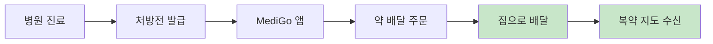
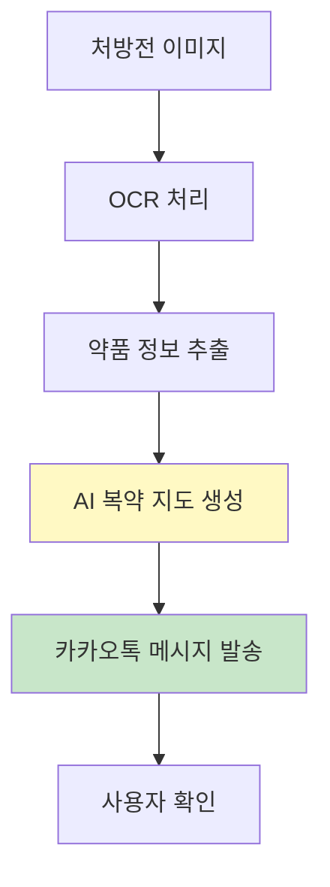
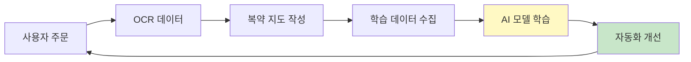
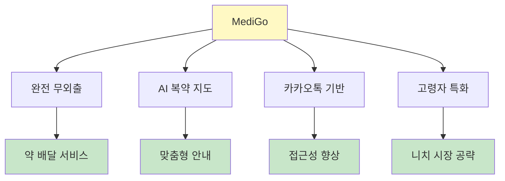

# MediGo 경쟁 우위 분석

기존 비대면 진료 서비스와의 차별화 포인트 및 시장 필요성

---

## 경쟁사 분석: 닥터나우 vs MediGo

### 서비스 비교표

| 구분 | 닥터나우 | **MediGo** |
|------|---------|-----------|
| **핵심 서비스** | 비대면 진료 + 처방전 전송 | **약 배달 + 복약 지도** |
| **처방전 처리** | 앱으로 약국에 전송 | 앱으로 업로드 → 운영자 처리 |
| **약 수령 방식** | 약국 직접 픽업 | **집으로 배달** |
| **외출 필요 여부** | 약국 방문 필요 | **완전 무외출** |
| **복약 지도** | 제공 안 함 | **AI 기반 맞춤형 복약 지도** |
| **타겟 고객** | 일반 성인 | **고령자, 감염성 질환 환자, 보호자** |
| **접근성** | 앱 설치 필요 | **카카오톡 채널 기반** (설치 불필요) |
| **AI 활용** | 없음 | **OCR + LLM 기반 복약 지도** |
| **데이터 수집** | 없음 | **학습 데이터 수집으로 지속 개선** |

---

## MediGo의 핵심 차별화 포인트

### 1. 완전 무외출 서비스



**닥터나우**: 병원 방문 불필요하지만 약국 픽업은 여전히 필요  
**MediGo**: 병원 → 약국 → 집, 모든 과정을 집에서 해결

**시장 필요성**:
- 고령자, 감염성 질환 환자는 외출 자체가 부담
- 밤/주말, 보호자가 없는 상황에서 약 수령 어려움
- 감기/독감 등 전염성 질환 시 약국 방문은 2차 감염 위험

---

### 2. AI 기반 맞춤형 복약 지도



**닥터나우**: 복약 지도 제공 안 함  
**MediGo**: 처방약 정보를 바탕으로 AI가 맞춤형 복약 지도 생성

**핵심 가치**:
- 약봉투에 적힌 복잡한 정보를 이해하기 쉬운 언어로 변환
- 복용 시간, 주의사항, 부작용 등을 개인화하여 안내
- 고령자도 쉽게 이해할 수 있는 복약 가이드

**AI 데이터 수집**:
- MVP 단계: 운영자가 수동 작성 (Wizard of Oz)
- 데이터 수집: OCR 텍스트 + 복약 지도 페어
- 향후: LLM 파인튜닝으로 자동화

---

### 3. 카카오톡 채널 기반 접근성

**닥터나우**: 앱 설치 필요 (앱스토어/구글플레이)  
**MediGo**: 카카오톡 채널만으로 서비스 이용 가능

**접근성 비교**:

| 구분 | 닥터나우 | MediGo |
|------|---------|--------|
| 앱 설치 | 필수 | 불필요 |
| 회원가입 | 복잡 | 카카오 로그인으로 간편 |
| 사용자 진입 장벽 | 높음 | 낮음 |
| 고령자 친화성 | 보통 | 높음 |

**특히 고령자/보호자에게 유리**:
- 앱 설치/업데이트 불필요
- 카카오톡만 있으면 즉시 이용 가능
- 친숙한 카카오톡 인터페이스

---

### 4. 타겟 고객 특화

### 닥터나우 타겟
- 일반 성인
- 비대면 진료가 필요한 사람
- 약국 픽업 가능한 사람

### MediGo 타겟
- **고령자**: 외출이 부담스러운 60세 이상
- **감염성 질환 환자**: 감기/독감 등 전염성 질환으로 외출 제한
- **보호자**: 가족의 약을 대신 챙겨야 하는 보호자
- **직장인**: 약국 운영 시간에 맞추기 어려운 직장인
- **야간/주말**: 약국 운영 시간 외에 약이 필요한 경우

**시장 규모**:
- 고령 인구: 2024년 기준 65세 이상 인구 900만 명 이상
- 감기/독감 환자: 연간 수천만 명
- 보호자: 가족 돌봄이 필요한 가구 수백만 가구

---

### 5. 지속적 개선 시스템



**닥터나우**: 정적 서비스 (개선 없음)  
**MediGo**: Wizard of Oz 방식으로 데이터 수집 → AI 자동화

**핵심 전략**:
1. MVP 단계: 운영자가 수동으로 복약 지도 작성
2. 데이터 수집: OCR 텍스트 + 복약 지도 페어 축적
3. AI 학습: LLaMA 3 기반 한국어 모델 파인튜닝
4. 자동화: AI가 자동으로 복약 지도 생성

**경쟁 우위**:
- 사용자 데이터가 쌓일수록 서비스 품질 향상
- 시간이 지날수록 운영 비용 감소
- AI 모델이 더 정확해질수록 차별화 강화

---

## 시장 필요성

### 1. 해결하지 못한 닥터나우의 문제점

#### 약국 픽업의 한계

```
닥터나우 사용자 여정:
병원 방문 불필요 → 비대면 진료 → 처방전 전송 → 약국 방문 필요 → 약 픽업 필요
```

**문제점**:
- 여전히 약국 방문 필요
- 약국 운영 시간 제약
- 약국 대기 시간 발생
- 감염성 질환 시 2차 감염 위험

#### 복약 지도 부재

- 약봉투에 적힌 복잡한 정보를 사용자가 직접 해석해야 함
- 고령자나 의료 지식이 없는 사람은 이해하기 어려움
- 복용 실수로 인한 부작용 위험

---

### 2. MediGo가 해결하는 문제

#### 완전 무외출 서비스

```
MediGo 사용자 여정:
병원 방문 불필요 → 비대면 진료 → 처방전 업로드 → 집에서 대기 → 약 배달 → 복약 지도 수신
```

**해결**:
- 약국 방문 불필요
- 약국 운영 시간 제약 없음
- 대기 시간 없음
- 완전 무외출로 감염 위험 제로

#### AI 기반 복약 지도

- 약봉투 정보를 이해하기 쉬운 언어로 변환
- 개인 맞춤형 복용 가이드 제공
- 복용 시간, 주의사항, 부작용 안내
- 고령자도 쉽게 이해 가능

---

## 시장 기회 분석

### 1. 시장 규모

| 시장 세그먼트 | 규모 | 성장률 |
|-------------|------|--------|
| **고령 인구** | 900만+ 명 | 연평균 4% 증가 |
| **감기/독감 환자** | 연간 2,000만+ 명 | 계절적 변동 |
| **보호자** | 수백만 가구 | 증가 추세 |
| **비대면 진료 시장** | 연간 수백억 원 | 급성장 중 |

### 2. 시장 트렌드

#### 비대면 의료 서비스 확대
- 2024년 비대면 진료 시범사업 지침 개정안 공고
- 365일 24시간 비대면 진료 가능
- 코로나 이후 비대면 의료 수용도 증가

#### 배달 서비스 확산
- 음식 배달, 쇼핑 배달 등 배달 서비스 일상화
- 의약품 배달에 대한 수용도 증가
- 약사법 개정으로 약 배달 규제 완화 가능성

#### AI 의료 서비스 성장
- AI 기반 진단, 처방 보조 서비스 증가
- 개인화된 의료 정보 제공 수요 증가
- LLM 기반 의료 챗봇 서비스 확산

---

## 경쟁 전략

### 1. 차별화 전략



### 2. 시장 진입 전략

#### Phase 1: 니치 시장 공략
- 고령자, 감염성 질환 환자 집중
- 약 배달 서비스로 차별화
- 복약 지도로 부가 가치 제공

#### Phase 2: 시장 확장
- AI 자동화로 운영 비용 감소
- 서비스 품질 향상으로 사용자 확대
- 병원/약국 파트너십 확대

#### Phase 3: 플랫폼화
- 다양한 병원/약국 연동
- AI 복약 지도 API 제공
- 의료 데이터 플랫폼 구축

---

## 왜 지금 필요한가?

### 1. 시장 타이밍

- 비대면 진료 정착: 2024년 비대면 진료 시범사업 확대
- 배달 서비스 일상화: 음식, 쇼핑 배달이 일상이 된 시대
- AI 기술 성숙: LLM 기술 발전으로 AI 복약 지도 가능
- 고령화 가속: 고령 인구 증가로 무외출 서비스 수요 증가

### 2. 기술적 가능성

- OCR 기술: EasyOCR 등 한글 OCR 기술 성숙
- LLM 기술: LLaMA 3 등 오픈소스 LLM 활용 가능
- 카카오 API: 카카오톡 채널 API로 접근성 확보
- 클라우드 인프라: AWS 등 클라우드 서비스로 빠른 개발 가능

### 3. 규제 환경

- 비대면 진료 허용: 보건복지부 시범사업 확대
- 약 배달 규제 완화 가능성: 약사법 개정 논의 중
- 의료 데이터 활용: AI 학습 데이터 수집 가능

---

## 경쟁 우위 요약

### 핵심 차별화 포인트

| 차별화 요소 | 설명 | 경쟁 우위 |
|------------|------|----------|
| **완전 무외출** | 약국 방문 불필요, 집으로 배달 | ⭐⭐⭐⭐⭐ |
| **AI 복약 지도** | 맞춤형 복약 안내 제공 | ⭐⭐⭐⭐⭐ |
| **카카오톡 기반** | 앱 설치 불필요, 접근성 높음 | ⭐⭐⭐⭐ |
| **고령자 특화** | 외출 부담 있는 고령자 타겟 | ⭐⭐⭐⭐ |
| **지속적 개선** | 데이터 수집으로 AI 자동화 | ⭐⭐⭐⭐⭐ |

### 시장 포지셔닝

```
                    약 배달
                        │
                        │
        [닥터나우]      │      [MediGo]
     (비대면 진료)      │   (약 배달 + 복약 지도)
                        │
                        │
        약국 픽업 ──────┼────── 집 배달
                        │
                        │
                    복약 지도
```

**MediGo의 위치**: 비대면 진료 + 약 배달 + 복약 지도의 **통합 솔루션**

---

## 결론

### MediGo가 시장에 필요한 이유

1. **완전 무외출 서비스**: 닥터나우가 해결하지 못한 "약국 픽업" 문제 해결
2. **AI 기반 복약 지도**: 기존 서비스에서 제공하지 않는 부가 가치
3. **고령자/감염성 질환 환자 특화**: 니치 시장에서 강력한 경쟁 우위
4. **카카오톡 기반 접근성**: 앱 설치 장벽 제거로 사용자 확대
5. **지속적 개선 시스템**: 데이터 수집으로 시간이 지날수록 경쟁력 강화

### 시장 기회

- **고령 인구 증가**: 900만+ 명의 잠재 고객
- **비대면 의료 확대**: 정부 정책 지원
- **배달 서비스 일상화**: 사용자 수용도 증가
- **AI 기술 성숙**: 기술적 구현 가능성 확보

**MediGo는 단순한 약 배달 서비스가 아닌, "처방전부터 복약까지" 전체 여정을 디지털화하는 통합 솔루션입니다.**

---

**참고 자료**:
- [닥터나우 공식 웹사이트](https://doctornow.co.kr/)
- 보건복지부 비대면 진료 시범사업 지침 개정안 공고 (2024-239호)

