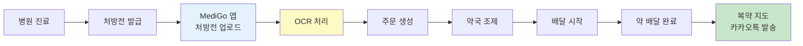
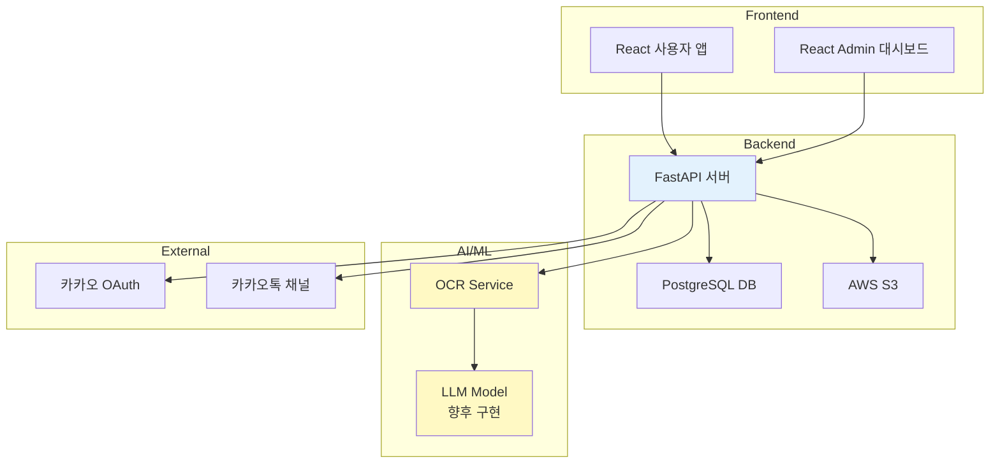
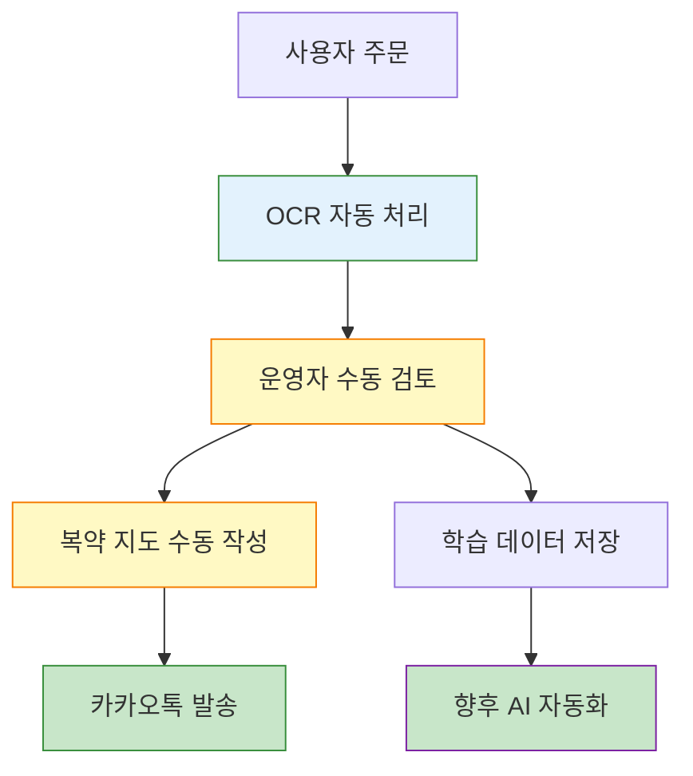
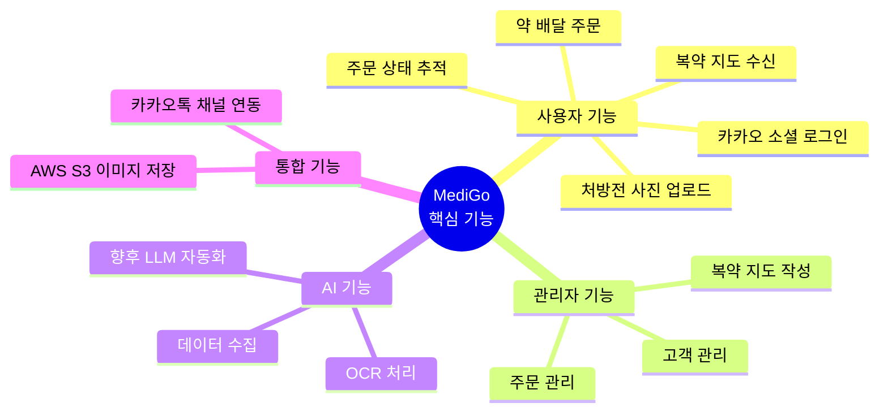
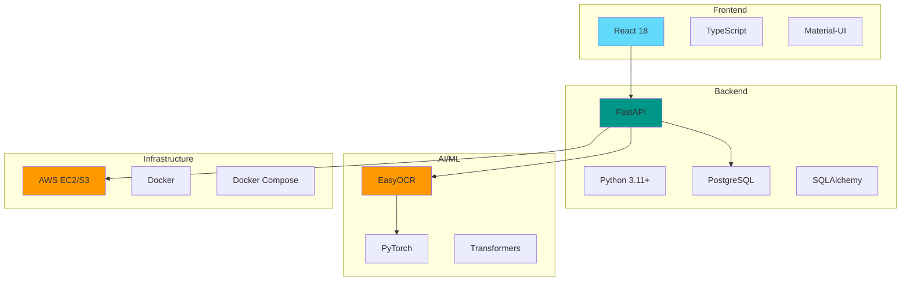
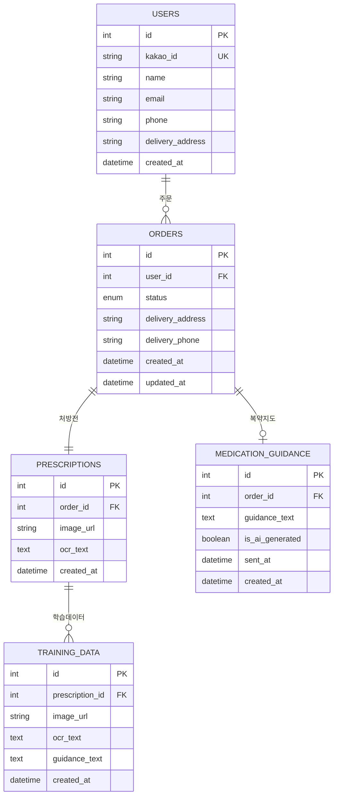
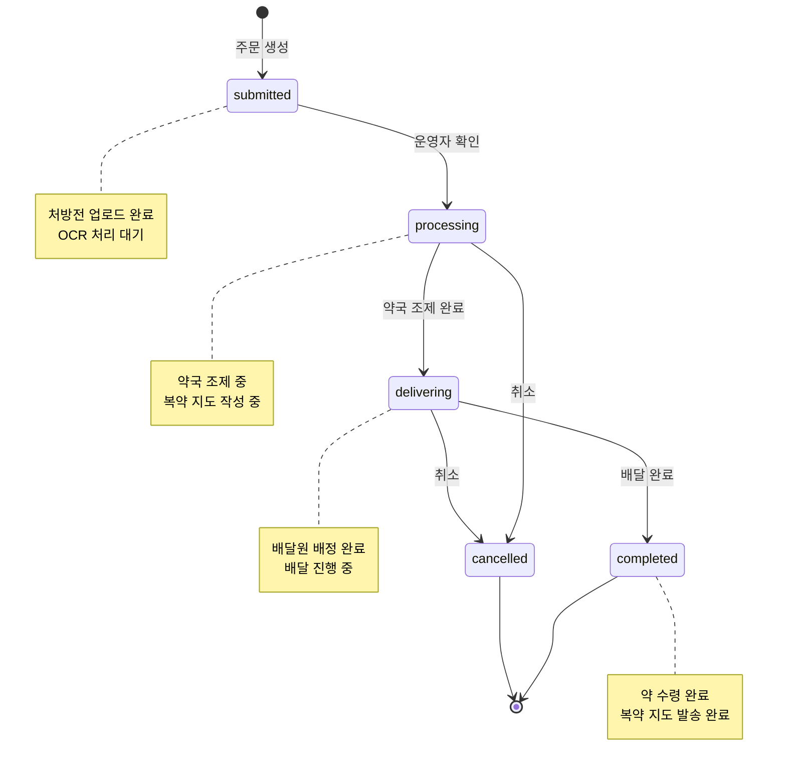
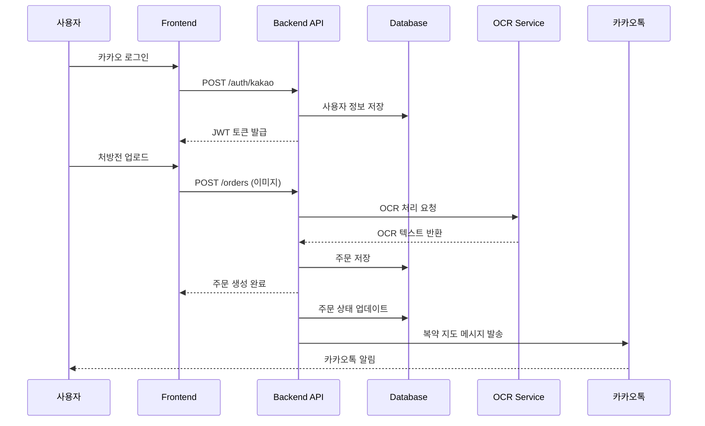
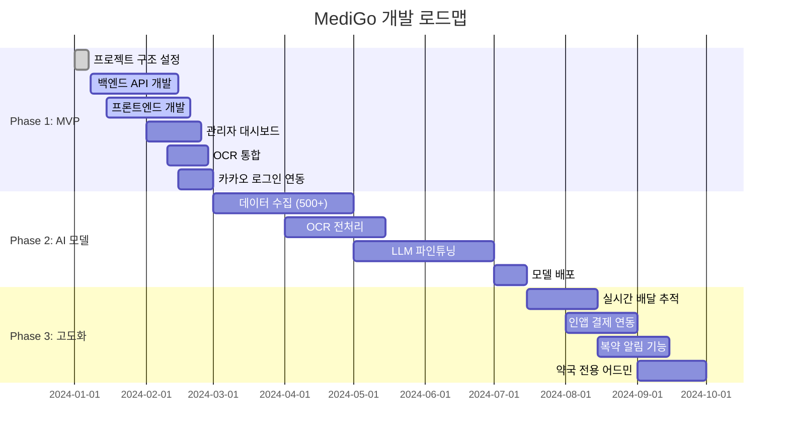

<div style="background: linear-gradient(135deg, rgba(255, 255, 255, 0.15) 0%, rgba(255, 255, 255, 0.05) 100%); backdrop-filter: blur(15px); -webkit-backdrop-filter: blur(15px); border: 1px solid rgba(255, 255, 255, 0.3); border-radius: 25px; padding: 40px; box-shadow: 0 8px 32px 0 rgba(31, 38, 135, 0.2), inset 0 1px 0 rgba(255, 255, 255, 0.3);">

<table>
<tr>
<td width="60%" valign="top">

<div align="center">


# 메디-고 (Medi-Go) 🏥💊

**AI 기반 약 배달 및 복약 지도 서비스**

[](LICENSE)
[](https://www.python.org/)
[](https://fastapi.tiangolo.com/)
[](https://reactjs.org/)

</div>

</td>
<td width="40%" valign="top">

<div align="center">

## 👥 팀 우리동네약배달

<table>
  <tr>
    <td align="center">
      <br/>
      <b>이현민</b><br/>
      <sub>팀장</sub>
    </td>
    <td align="center">
      <br/>
      <b>남상훈</b><br/>
      <sub>팀원</sub>
    </td>
    <td align="center">
      <br/>
      <b>권덕현</b><br/>
      <sub>팀원</sub>
    </td>
  </tr>
</table>

</div>

</td>
</tr>
</table>

---

## 프로젝트 개요

처방전 사진을 앱으로 전송하면, 운영팀이 약국 조제 및 배달을 대행하고, 복약 지도 메시지를 앱을 통해 텍스트로 전달하는 서비스입니다.

### 시연 영상

<div align="center">

[](https://cicada31113.github.io/MediGo/)

</div>

### 사용자 플로우



### 시스템 아키텍처



MVP 단계에서는 Wizard of Oz 방식으로 운영하며, 사용자에게 서비스 가치를 제공하면서 동시에 AI 모델 학습을 위한 데이터를 수집합니다.

### Wizard of Oz 운영 방식



**현재 (MVP)**: 운영자가 수동으로 복약 지도 작성 → 데이터 수집  
**향후**: AI가 자동으로 복약 지도 생성

### 핵심 기능 (MVP)



**주요 기능:**
- 카카오 소셜 로그인
- 처방전 사진 업로드
- 약 배달 주문 및 상태 추적
- 맞춤형 복약 지도 메시지 수신
- 카카오톡 채널 메시지 발송
- 고객 관리 (카카오톡 채널 고객파일)
- 관리자 대시보드 (주문 관리, 복약 지도 작성)
- AI 학습 데이터 수집 (OCR + 복약 지도 페어)

## 기술 스택

### 기술 스택 다이어그램



### Backend
- **Framework**: FastAPI 0.104+
- **Language**: Python 3.11+ (권장)
- **Database**: PostgreSQL 15+
- **ORM**: SQLAlchemy 2.0+
- **Migration**: Alembic
- **Authentication**: JWT + OAuth 2.0 (Kakao)
- **Image Storage**: AWS S3
- **OCR**: EasyOCR (한글 지원)

### Frontend (User App)
- **Framework**: React 18+
- **Language**: TypeScript 5+
- **UI Library**: Material-UI (MUI)
- **State Management**: React Query + Zustand
- **HTTP Client**: Axios
- **Build Tool**: Vite

### Admin Dashboard
- **Framework**: React 18+
- **Language**: TypeScript 5+
- **UI Library**: Material-UI (MUI) + React Admin
- **State Management**: React Query + Zustand

### AI/ML
- **OCR**: EasyOCR
- **Framework**: PyTorch 2.0+
- **Model**: Transformers (Hugging Face)
- **Target Model**: LLaMA 3 기반 한국어 모델 (향후)

### Infrastructure
- **Cloud**: AWS (EC2, S3, RDS)
- **Container**: Docker
- **Orchestration**: Docker Compose

## 프로젝트 구조

```
medigo/
├── 01 - Docs/              # 기술 문서
│   ├── API.md
│   ├── SETUP.md
│   └── DEPLOYMENT.md
├── 01 - Documents/         # 프로젝트 문서
│   ├── 01 - 기획/
│   ├── 02 - 설계/
│   └── 03 - 구현/
├── 02 - Backend/           # FastAPI 백엔드 서버
│   ├── app/
│   │   ├── api/           # API 엔드포인트
│   │   ├── core/          # 설정, 보안, 의존성
│   │   ├── models/        # SQLAlchemy 모델
│   │   ├── schemas/       # Pydantic 스키마
│   │   ├── services/      # 비즈니스 로직
│   │   └── utils/        # 유틸리티 함수
│   ├── alembic/           # DB 마이그레이션
│   └── requirements.txt
├── 03 - Frontend/          # 사용자 웹앱 (React)
├── 04 - Admin/            # 관리자 대시보드 (React)
├── 05 - ML/               # AI/ML 모듈
│   ├── ocr/              # OCR 서비스
│   ├── models/           # 학습된 모델
│   └── training/         # 학습 스크립트
├── 06 - Docker/           # Docker 설정
├── 07 - Scripts/          # 유틸리티 스크립트
└── docker-compose.yml
```

## 빠른 시작

### 1단계: 필수 프로그램 설치 확인

```bash
# Python 버전 확인 (3.11 이상 권장)
python --version

# Node.js 버전 확인 (18 이상)
node --version

# PostgreSQL 확인
psql --version
```

### 2단계: 데이터베이스 생성

```bash
# PostgreSQL 접속
psql -U postgres

# 데이터베이스 생성
CREATE DATABASE medigo_db;
\q
```

### 3단계: Backend 실행

```bash
# 백엔드 디렉토리로 이동
cd "02 - Backend"

# 가상환경 생성 및 활성화
python -m venv venv

# Windows
venv\Scripts\activate

# Mac/Linux
source venv/bin/activate

# 패키지 설치
pip install -r requirements.txt

# 환경 변수 복사
copy env.example .env    # Windows
cp env.example .env      # Mac/Linux

# .env 파일 편집 (데이터베이스 연결 정보 입력)

# 데이터베이스 마이그레이션
alembic upgrade head

# 서버 실행
uvicorn app.main:app --reload
```

Backend API: http://localhost:8000/docs

### 4단계: Frontend 실행 (새 터미널)

```bash
# 프론트엔드 디렉토리로 이동
cd "03 - Frontend"

# 패키지 설치
npm install

# 개발 서버 실행
npm run dev
```

사용자 앱: http://localhost:3000

### 5단계: 로그인

1. http://localhost:3000 접속
2. "데모 로그인" 버튼 클릭
3. 홈 화면으로 이동

## 완료

다음 기능을 테스트할 수 있습니다:
- 처방전 업로드 (이미지 파일)
- 주문 생성
- 주문 목록 조회
- 프로필 관리

## 상세 설치 가이드

### Python 환경 (Backend + ML)

```bash
# 1. 가상환경 생성
python -m venv venv

# 2. 가상환경 활성화
# Windows:
venv\Scripts\activate
# Mac/Linux:
source venv/bin/activate

# 3. 전체 패키지 설치
pip install -r requirements.txt
```

### Node.js 환경 (Frontend + Admin)

```bash
# Frontend 설치
cd "03 - Frontend"
npm install

# Admin 설치
cd "../04 - Admin"
npm install
```

### 필수 시스템 요구사항

- **Python**: 3.11 이상 (권장) - Python 3.13은 호환성 문제 가능
- **Node.js**: 18 이상
- **PostgreSQL**: 15 이상
- **운영체제**: Windows 10/11, macOS 10.15+, Ubuntu 20.04+

## 카카오톡 채널 설정

### 1단계: 카카오톡 채널 생성 (2분)

1. https://center-pf.kakao.com/ 접속
2. "새 채널 만들기" 클릭
3. 채널명: 메디-고
4. 채널 URL에서 프로필 ID 확인 (예: `_ZeUTxl`)

### 2단계: 카카오 디벨로퍼스 설정 (2분)

1. https://developers.kakao.com/ 접속
2. **내 애플리케이션** > **애플리케이션 추가하기**
3. 앱 정보 입력 후 생성
4. **제품 설정** > **카카오톡 채널** > 채널 추가
5. **고객 관리 API 정책 동의** 체크 (중요!)
6. **앱 설정** > **앱 키**에서 다음 키 복사:
   - REST API 키
   - Admin 키

### 3단계: 환경 변수 설정 (1분)

`02 - Backend/.env` 파일에 추가:

```env
# Kakao Talk Channel
KAKAO_REST_API_KEY=복사한_REST_API_키
KAKAO_ADMIN_KEY=복사한_Admin_키
KAKAO_CHANNEL_PUBLIC_ID=_ZeUTxl
KAKAO_CHANNEL_API_URL=https://kapi.kakao.com
```

### 완료 체크리스트

- [ ] 카카오 디벨로퍼스 앱 생성 완료
- [ ] REST API 키 발급 완료
- [ ] Admin 키 확인 완료
- [ ] 카카오톡 채널 연결 완료
- [ ] 고객 관리 API 정책 동의 완료
- [ ] `02 - Backend/.env` 파일에 키 입력 완료

더 자세한 설정은 [`01 - Docs/KAKAO_CHANNEL_SETUP.md`](01%20-%20Docs/KAKAO_CHANNEL_SETUP.md)를 참고하세요.

## 문제 해결

### Python 버전 문제

**문제**: Python 3.13은 최신 버전이어서 일부 패키지 호환성 문제가 발생할 수 있습니다

**해결**: Python 3.11 사용 (권장)

```bash
# Python 3.11로 새 가상환경 생성
py -3.11 -m venv venv

# 활성화
venv\Scripts\activate

# 패키지 설치
pip install -r requirements.txt
```

### 데이터베이스 연결 오류

```bash
# PostgreSQL이 실행 중인지 확인
# Windows
services.msc → PostgreSQL 서비스 확인

# Mac
brew services list

# Linux
sudo systemctl status postgresql
```

### 포트 이미 사용 중 오류

```bash
# Windows: 포트 사용 중인 프로세스 종료
netstat -ano | findstr :8000
taskkill /PID <PID번호> /F

# Mac/Linux
lsof -ti:8000 | xargs kill -9
```

### Python 패키지 설치 오류

```bash
pip install --upgrade pip
pip install -r requirements.txt --no-cache-dir
```

### PyTorch 설치 오류

**CPU 버전만 필요한 경우**:
```bash
pip install torch torchvision --index-url https://download.pytorch.org/whl/cpu
```

**GPU (CUDA) 버전**:
```bash
pip install torch torchvision --index-url https://download.pytorch.org/whl/cu118
```

### 카카오 API 오류

- **401 Unauthorized**: REST API 키 또는 Admin 키 확인
- **403 Forbidden**: 고객 관리 API 정책 동의 확인
- **404 Not Found**: 채널 프로필 ID 확인 (앞에 `_` 포함)

## 데이터베이스 스키마

### ERD (Entity Relationship Diagram)



### 주요 테이블 설명

- `users` - 사용자 정보 (카카오 OAuth 정보, 배달 주소)
- `orders` - 주문 정보 (상태: submitted → processing → delivering → completed)

### 주문 상태 플로우


- `prescriptions` - 처방전 정보 (이미지 S3 URL, OCR 텍스트)
- `medication_guidance` - 복약 지도 (텍스트, AI 생성 여부, 발송 정보)
- `training_data` - AI 학습 데이터 (약봉투 이미지, OCR 텍스트, 복약 지도)

## API 문서

Backend 서버 실행 후:
- Swagger UI: http://localhost:8000/docs
- ReDoc: http://localhost:8000/redoc

### API 플로우



### 주요 엔드포인트

**인증**
- `POST /api/v1/auth/kakao` - 카카오 로그인
- `POST /api/v1/auth/refresh` - 토큰 갱신

**사용자**
- `GET /api/v1/users/me` - 내 프로필 조회
- `PUT /api/v1/users/me` - 내 프로필 수정

**주문**
- `POST /api/v1/orders` - 주문 생성
- `GET /api/v1/orders` - 내 주문 목록
- `GET /api/v1/orders/{order_id}` - 주문 상세

**관리자**
- `GET /api/v1/admin/orders` - 전체 주문 목록
- `PUT /api/v1/admin/orders/{order_id}` - 주문 수정
- `POST /api/v1/admin/medication-guidance` - 복약 지도 작성

더 자세한 API 문서는 [`01 - Docs/API.md`](01%20-%20Docs/API.md)를 참고하세요.

## 보안

- HTTPS - 모든 통신 암호화
- JWT - 토큰 기반 인증 (Access + Refresh)
- S3 암호화 - 서버 사이드 암호화 (AES256)
- DB 암호화 - 민감 정보 암호화
- 접근 제어 - RBAC (Role-Based Access Control)

## 개발 로드맵

### 로드맵 타임라인



### Phase 1: MVP (현재)
- [x] 프로젝트 구조 설정
- [ ] 백엔드 API 개발
- [ ] 프론트엔드 개발
- [ ] 관리자 대시보드 개발
- [ ] OCR 통합
- [ ] 카카오 로그인 연동

### Phase 2: AI 모델 개발
- [ ] 데이터 수집 (500+ 주문)
- [ ] OCR 데이터 전처리
- [ ] LLM 파인튜닝 (LLaMA 3 기반)
- [ ] 모델 배포

### Phase 3: 고도화
- [ ] 실시간 배달 추적
- [ ] 인앱 결제 연동
- [ ] 복약 알림 기능
- [ ] 약국 전용 어드민

## 주요 URL

| 서비스 | URL | 설명 |
|--------|-----|------|
| Backend API | http://localhost:8000 | FastAPI 서버 |
| API 문서 | http://localhost:8000/docs | Swagger UI |
| 사용자 앱 | http://localhost:3000 | React 앱 |
| 관리자 대시보드 | http://localhost:3001 | Admin 패널 |
| OCR 서비스 | http://localhost:8001 | OCR API |

## 법적 고지

서비스 운영 시 다음 법규를 준수해야 합니다:
- 약사법 - 약 배달 관련 규제
- 의료법 - 비대면 진료 관련 규제
- 개인정보보호법 - 민감 의료정보 처리
- 규제 샌드박스 - 서비스 운영 범위

MVP 개발 전 법률 전문가와 보건복지부 유권해석을 받는 것을 권장합니다.

## 추가 문서

- [상세 설정 가이드](01%20-%20Docs/SETUP.md)
- [API 문서](01%20-%20Docs/API.md)
- [배포 가이드](01%20-%20Docs/DEPLOYMENT.md)
- [프로젝트 문서](01%20-%20Documents/)

## 문의

이슈로 문의 바랍니다.

## 라이선스

Private - All Rights Reserved

---

**버전**: 1.0.0  
**최종 업데이트**: 2024-01-16

</div>
